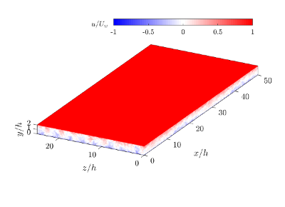

# channel

`channel` is a Cartesian channel-flow DNS code for incompressible
Navier-Stokes equations. It uses Fourier expansions in the periodic streamwise and
spanwise directions, compact wall-normal operators, MPI decomposition in the
wall-parallel and wall-normal directions, and optional GPU acceleration.


<p>
<br/><br/><br/><br/><br/>
Turbulent Couette flow<br/>
at a friction Reynolds number of Re_tau = 500<br/>
3 752 787 600 DoF
</p>
<br clear="left"/>

## Current Features

- CPU builds with GNU or Intel-like Fortran compilers, MPI, and FFTW.
- GPU builds for NVIDIA/NVHPC with cuFFT, cuSPARSE, CUDA runtime, and optional NCCL.
- GPU builds for AMD/Cray or LLVM Flang with hipfort, hipFFT, hipSPARSE, and optional RCCL.
- MPI x/z decomposition for Fourier transposes.
- Distributed wall-normal solves using a hierarchical y-Schur solver.
- Optional autotuning of MPI decomposition, y-Schur pass hierarchy, and y-solve batch sizes.
- Constant streamwise/spanwise flow-rate correction or prescribed mean pressure gradients.
- Optional passive scalar fields.
- Optional pressure and `dpdy` post-processing.
- Optional raw convection-velocity/statistics output through the `[convvelo]` input section.

## Repository Layout

```text
src/channel.f90              Main DNS executable
src/core/                    DNS state, driver, pressure output, config parser
src/fft/                     FFT backends
src/gpu/                     NCCL/RCCL C bridge and Fortran communication wrapper
src/linsolve/                Compact and wall-normal line solvers
src/mpi/                     MPI decomposition, transposes, autotuning
src/post/                    post_pressure and post_convvelo executables
src/test/                    Fortran test programs
cmake/                       CMake helper modules and CTest definitions
tests/                       Regression input and reference data
examples/                    Example dns.in input decks
postpro/                     Python post-processing utilities
```

## Dependencies

Required for the standard CPU build:

- CMake 3.16 or newer
- Fortran 2008 compiler
- C compiler
- MPI with the Fortran `mpi_f08` interface
- FFTW 3 double-precision library
- Python 3, used by CTest helper scripts

Additional NVIDIA GPU build requirements:

- NVHPC Fortran compiler
- CUDA Toolkit
- cuFFT, cuSPARSE, CUDA runtime
- Optional NCCL for `CHANNEL_COMM=nccl`

Additional AMD GPU build requirements:

- Cray Fortran or LLVM Flang configured for AMD offload
- hipfort with hip, hipFFT, and hipSPARSE
- Optional RCCL for `CHANNEL_COMM=nccl`

## Build

### CPU With MPI And FFTW

```bash
cmake -S . -B build -DCMAKE_Fortran_COMPILER=mpifort
cmake --build build -j
ctest --test-dir build --output-on-failure
```

If CMake finds plain `f95` before your MPI wrapper, set
`-DCMAKE_Fortran_COMPILER=mpifort` explicitly.

### CPU Without MPI

```bash
cmake -S . -B build-nompi -DNOMPI=ON
cmake --build build-nompi -j
```

The MPI build is the normal production path. Use `NOMPI` only for small local
experiments.

### NVIDIA GPU

Load the NVHPC and CUDA environment first, then configure with `nvfortran`:

```bash
cmake -S . -B build-nvhpc \
  -DCMAKE_Fortran_COMPILER=nvfortran \
  -DCMAKE_C_COMPILER=nvc \
  -DCMAKE_CUDA_ARCHITECTURES=90
cmake --build build-nvhpc -j
```

Set `NCCL_ROOT_DIR` or the usual `NCCL_HOME`/`LD_LIBRARY_PATH` hints if NCCL is
not in a standard location.

### AMD GPU

On Cray systems, load the PrgEnv/ROCm/hipfort modules and configure with the
compiler wrapper:

```bash
cmake -S . -B build-amd -DCMAKE_Fortran_COMPILER=ftn
cmake --build build-amd -j
```

For LLVM Flang, the current CMake path is configured for AMD offload and uses
`gfx942` in the compiler flags. Adjust `CMakeLists.txt` if your target GPU differs.

## Running

Run from a case directory containing `dns.in`. If `Dati.cart.out` is absent and
`time_from_restart = false`, the code generates a parabolic initial mean profile plus
small random perturbations.

```bash
mpirun -np 4 /path/to/build/channel
```

For example:

```bash
mkdir -p runs/kmm1987
cp examples/channel_kmm1987/dns.in runs/kmm1987/
cd runs/kmm1987
mpirun -np 4 /path/to/build/channel
```

The code writes output in the current working directory.

## Input File

The input file is INI-like. Comments may start with `#`, `!`, or `;`.

```ini
[mesh]
nx = 95
ny = 128
nz = 80
alfa0 = 0.5
beta0 = 1.0
stretching = 1.5
ymin = 0.0
ymax = 2.0

[velocity]
ni = 2800.0
meanpx = 0.0
meanpz = 0.0
meanflowx = 2.0
meanflowz = 0.0
u0 = 0.0
uN = 0.0
perturbation_amplitude = 1.0e-3

[scalars]
nPhi = 0
meantx = 0.0
meantb = 0.0
t0 = 0.0
tN = 0.0

[timestepping]
deltat = 0.0
cflmax = 0.6
time = 0.0
dt_field = 25.0
dt_save = 25.0
t_max = 1000.0
time_from_restart = false
nstep = 200000
```

Important fields:

- `nx`, `nz`: maximum stored Fourier mode indices in the homogeneous directions.
  The arrays store `nx + 1` streamwise modes and `2*nz + 1` spanwise modes.
- `ny`: wall-normal interval count. The physical walls are at `0` and `ny`; ghost
  rows extend storage to `-1:ny+1`.
- `alfa0`, `beta0`: fundamental wavenumbers. The physical periods are
  `Lx = 2*pi/alfa0` and `Lz = 2*pi/beta0`.
- `stretching`: hyperbolic-tangent wall-normal clustering parameter.
- `ni`: Reynolds number in the code's chosen velocity and half-height scaling.
  Internally the solver uses `1/ni` as the viscous coefficient.
- `meanflowx`, `meanflowz`: target integrated flow rates across the full channel.
  With `ymin = 0`, `ymax = 2`, `meanflowx = 2` gives unit bulk velocity.
- `meanpx`, `meanpz`: imposed mean pressure-gradient terms. Leave them zero when
  enforcing constant flow rate.
- `u0`, `uN`: streamwise wall velocities at the lower and upper walls.
- `deltat = 0`: let the code choose the time step from `cflmax`.
- `dt_field`: interval for `Dati.cart.<i>.out` field snapshots.
- `dt_save`: interval for overwriting `Dati.cart.out`; use a negative value to
  disable periodic restart saves.
- `time_from_restart`: if `true`, the starting time is read from `Dati.cart.out`;
  if `false`, the input `time` is used.

For passive scalars, set `nPhi > 0` and add `pr = ...` with one Prandtl number per
scalar.

## Optional Convvelo Output

Add a `[convvelo]` section to compute raw velocity/scalar correlation fields during
the run:

```ini
[convvelo]
output_mode = minimal
t_start = 100.0
dt_compute = 1.0
dt_write = 50.0
```

`output_mode` may be `full` or `minimal`. The output files are `convvelo.bin` or
`convvelo.<i>.bin`, with a companion `*.fields` layout file.

## Runtime Environment

Common controls:

| Variable | Meaning |
| --- | --- |
| `CHANNEL_NPY` | Number of wall-normal MPI slabs. |
| `CHANNEL_NPXZ` | Number of wall-parallel MPI groups. |
| `CHANNEL_MPI_AUTOTUNE` | `off`, `false`, or `0` disables autotuning; `report` prints a recommendation without applying it. |
| `CHANNEL_MPI_AUTOTUNE_REPEATS` | Timed repeats per autotune candidate. |
| `CHANNEL_Y_SOLVER` | Select y solver path, if manually overriding autotuning. |
| `CHANNEL_Y_PIPELINE_BATCHES` | Force the pipelined LU y-solver batch count; must be at least `1`. |
| `CHANNEL_Y_PIPELINE_TIMING` | Print detailed pipelined LU timing when set. |
| `CHANNEL_Y_SCHUR_PASSES` | Manual y-Schur hierarchy, e.g. `2x4`; product must equal `CHANNEL_NPY`. |
| `CHANNEL_Y_SCHUR_EXCHANGE` | `auto`, `alltoall`, or `allgather`. |
| `CHANNEL_OVERLAPPING` | Enable overlap of communication and computation where supported. |
| `CHANNEL_COMM` | `mpi`, `auto`, or `nccl`; `nccl` also selects RCCL on AMD builds. |
| `CHANNEL_DISABLE_RESTART_WRITE` | Skip final `Dati.cart.out` write, useful for profiling. |
| `CHANNEL_EXIT_AFTER_MPI_AUTOTUNE` | Exit after input parsing and decomposition/autotune setup. Useful for validating case files cheaply. |
| `CHANNEL_YS_BATCH_MAX_COMPLEX` | Cap y-solve complex workspace. |
| `CHANNEL_YS_CHUNK_NX` | Cap local x columns per y-line chunk. |
| `CHANNEL_YS_FORCE_CUSTOM_GPSV` | Force the built-in pentadiagonal solver instead of vendor sparse batched solve. |

Manual decomposition must satisfy:

```text
nproc = CHANNEL_NPXZ * CHANNEL_NPY
CHANNEL_NPXZ divides nx + 1
CHANNEL_NPXZ divides nzd
```

where `nzd = 3*nz`, possibly adjusted by the FFT-fit logic.

## Output Files

- `Runtimedata`: time, wall gradients, flow rates, pressure-gradient correction,
  runtime proxy, and time step.
- `Runtimedata.phi`: scalar wall gradients, scalar flow rates, and scalar correction.
- `Dati.cart.out`: restart file.
- `Dati.cart.<i>.out`: field snapshots at `dt_field`.
- `pField<i>.dat`, `dpdyField<i>.dat`: generated by `post_pressure`.
- `convvelo*.bin`, `convvelo*.bin.fields`: generated by `[convvelo]` or
  `post_convvelo`.

Restart files are binary stream files containing a small metadata header followed by
the complex spectral field. The metadata must match `dns.in`; the code stops on
mismatch.

## Post-Processing Executables

`post_pressure` scans the current directory for `Dati.cart.*.out`, computes pressure
and `dpdy`, and writes one file pair per snapshot:

```bash
mpirun -np 4 /path/to/build/post_pressure
```

`post_convvelo` scans `Dati.cart.*.out`, accumulates convvelo statistics according
to the `[convvelo]` section in `dns.in`, and writes a raw statistics file:

```bash
mpirun -np 4 /path/to/build/post_convvelo
```

The Python scripts in `postpro/` and `tools/export_scalar_raw_statistics.py` are utilities
for converting or deriving statistics from the binary output. They require the
Python scientific stack used by the local scripts (`numpy`, `xarray`, `dask`, `xrft`,
and related dependencies).

## Examples

Two paper-inspired input decks are included:

- `examples/channel_kmm1987/dns.in`: full channel-flow case based on
  Kim, Moin & Moser (1987), with `Lx = 4*pi`, `Lz = 2*pi`, and parameters chosen
  for the code's constant-bulk-flow convention.
- `examples/mfu_jm1991/dns.in`: minimal-flow-unit case based on
  Jimenez & Moin (1991), using `Re = 3000`, `Lx = pi`, and `Lz = 0.30*pi`.

These examples reproduce the intended physical boxes and forcing style, not the
exact numerical discretization of the papers. The papers used Chebyshev wall-normal
expansions; this code uses compact wall-normal operators. A random start also needs
a long transient before meaningful statistics can be compared.

References:

- Kim, Moin & Moser (1987), `https://chaosbook.org/library/KimJFM87.pdf`
- Jimenez & Moin (1991), `https://torroja.dmt.upm.es/pubs/1990s/jim_moin_91.pdf`

## Known Limitations

- Geometry is a Cartesian plane channel with periodic homogeneous directions.
- No immersed-boundary or arbitrary geometry support is active in this branch.
- Runtime input is INI-based only; old positional `dns.in` files are obsolete.
- Restart metadata must exactly match the case file; there is no automatic restart
  interpolation or resizing.
- The CPU build uses FFTW; GPU builds use vendor FFT/sparse libraries and depend
  strongly on the compiler environment.
- `CHANNEL_COMM=nccl` requires NCCL/RCCL discovery at CMake configure time.
- The example cases are starting points. Reproducing paper-quality statistics needs
  equilibrated restart fields, sufficient averaging time, and a resolution study.
